# 중고거래 사이트 PotatoMarket

-----------------

    
    <a href="http://potato-market.com" target="_blank">감자마켓 메인페이지</a>

-----------------

## Presentation and Testing Video
- **Youtube**:
    - [**Presentation**](https://www.youtube.com/watch?v=DFRlnNcDH-Q).

-----------------

## Contents
1. [소개](#소개)
2. [설계의 주안점](#설계의-주안점)
3. [Using](#using)
4. [Main Function](#main-function)
5. [Schedule](#schedule)
6. [Document](#document)

-----------------

## 소개
- 중고마켓은 현재 시장규모 20조원 정도 되는 쇼핑 앱 시장 트렌드로 부상하고 있으며 지역기반 플랫폼은 2019년 10대 소비트랜드로 선정되었습니다. 그리고 중고 거래의 인식 변화는 2015년 55%에서 2018년 72%로 점점 좋아지는 더 추세입니다.

- 저희는 현재 운영 중인 중고물품 거래 사이트를 비교 분석하고 단점은 보완, 장점은 결합하여 새로운 중고물품 거래 사이트를 개발하였습니다.

-----------------

## 설계의 주안점
- 우리 감자마켓은 "Simple", "Simple is best"라는 생각을 가지고 화면과 기능을 최대한 심플하게 구현하기 위해 힘썼습니다.
1. 웹페이지를 이용한 간편한 회원가입 / 로그인 시스템
2. HTML, CSS, jQuery를 이용한 사용자가 이해하기 쉬운 UI구성
3. HTML을 이용한 각각의 페이지 프레임 구성
4. MVC 모델2를 이용한 게시판 구성
5. AJAX를 이용한 테이블(화면전환) 처리
6. API를 활용한 회원가입 및 지도 검색 구현

-----------------

## Using

    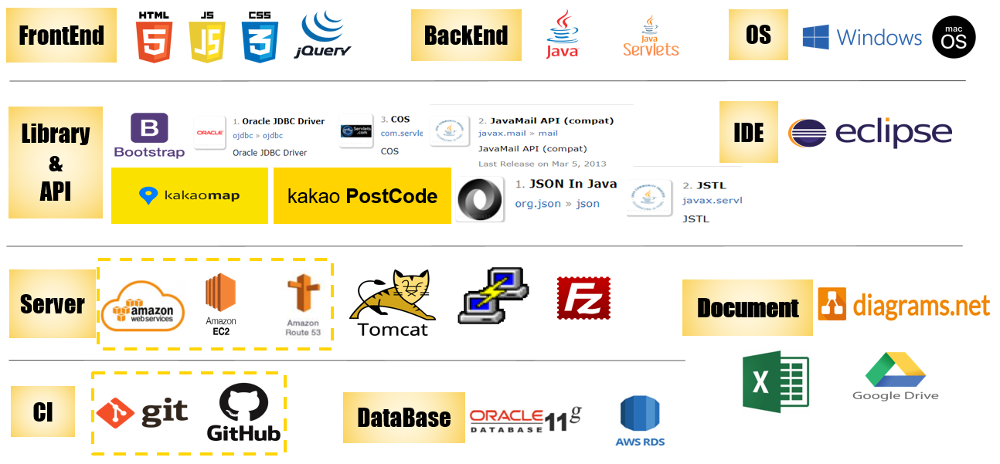

1. **FrontEnd** - HTML5, JS, CSS3, jQuery
2. **BackEnd** - Java(JDK 1.8), Servlet
3. **OS** - Windows, macOS (Amazon Linux 2 - aws)
4. **Library&API** - Kakaomap, Kakao Postcode, BootStrap(v3.3.7), OJDBC(v6), COS, JavaMail API, JSON(v1.2), JSTL
5. **IDE** - eclipse (EE, 2019-12 v4.14.0)
6. **Server** - AWS(EC2, Route 53), Tomcat(v8.5), Putty(v0.74), Filezilla(v3.50.0)
7. **Document** - Google Drive, diagrams.net
8. **CI** - git(v2.28.0.windows.1), Github
9. **DataBase** - AWS RDS, Oracle DataBase 11g

-----------------

## Main Function
- **Detailed** : can be found in <a href="http://potato-market.com" target="_blank">our Website</a>.

1. **자체 시세 조회 서비스**

    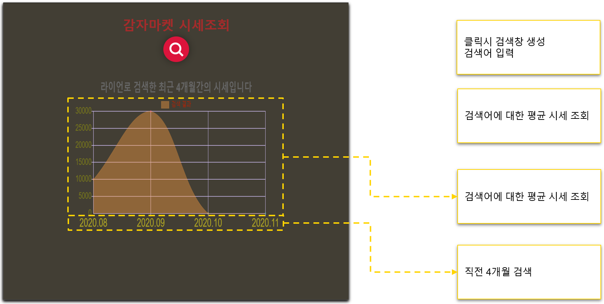

2. **카카오 맵을 이용한 지도 서비스**

    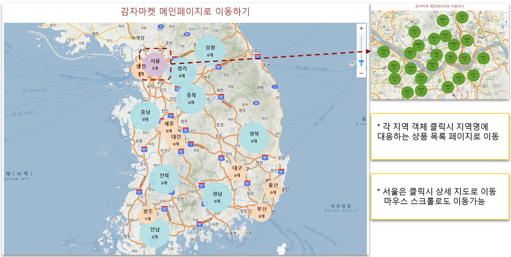

3. **회원, 게시판, 상품의 조회/등록/수정/삭제/추천**

    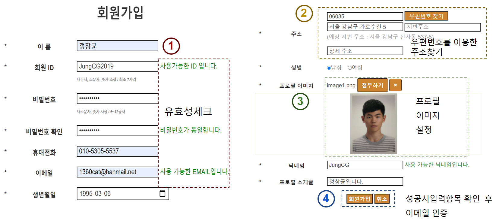

    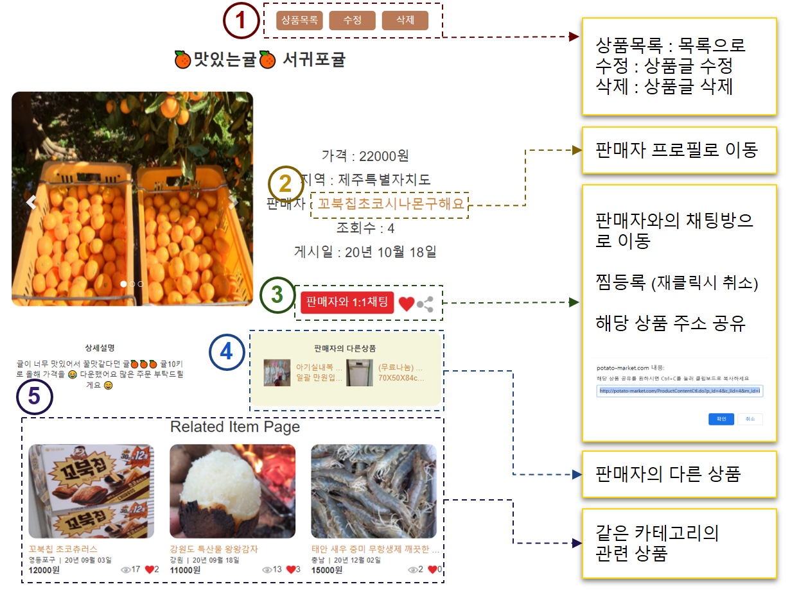

4. **관리자 페이지 (회원, 게시글, 상품, 신고 내역 관리)**

    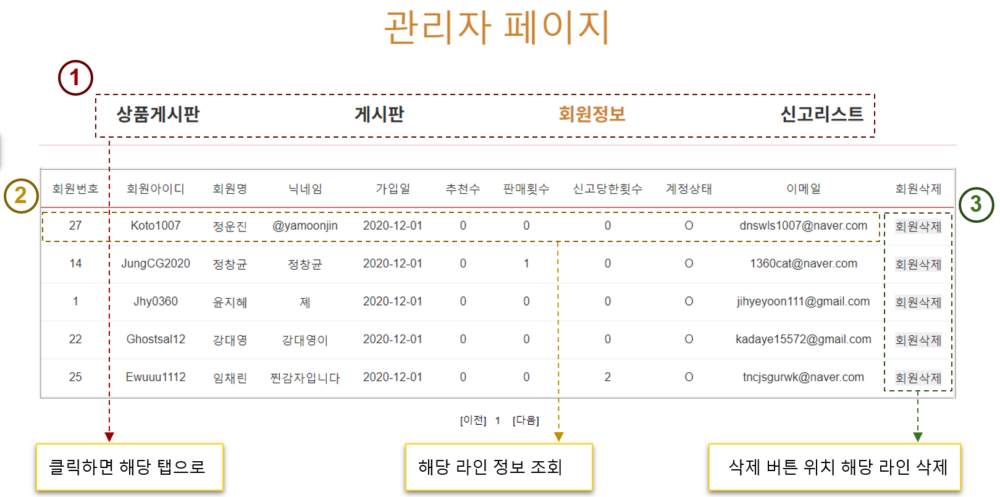

5. **채팅과 이메일, 관심 카테고리를 이용한 알림서비스**

    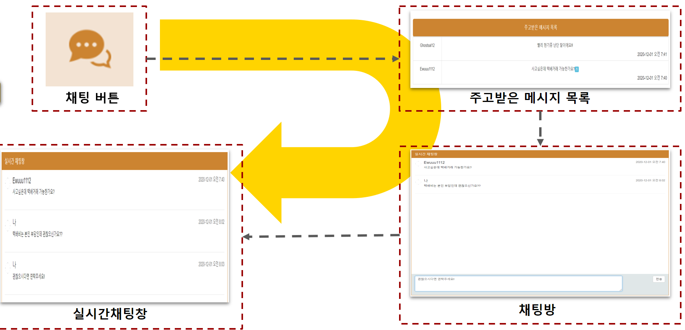

6. **파일 업로드 (프로필 사진, 게시판 사진, 상품 사진)**

    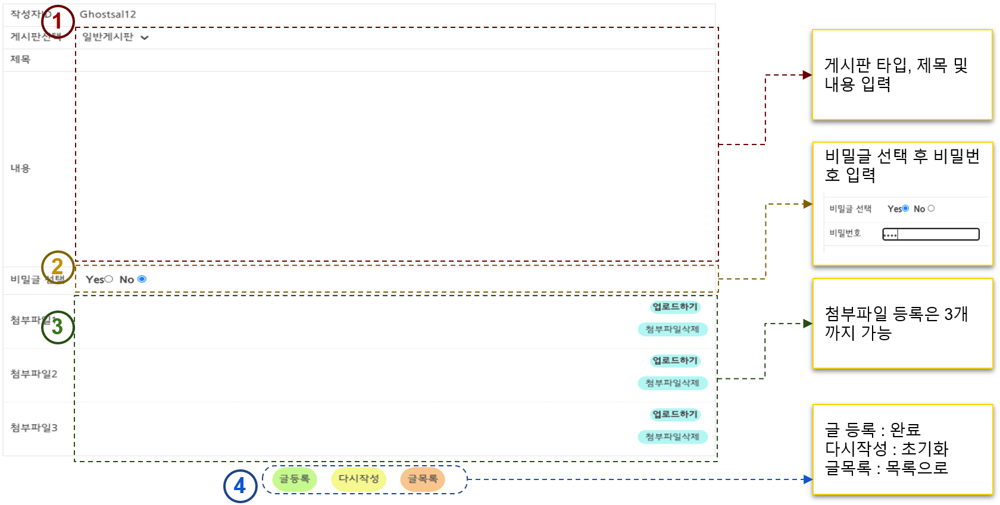

7. **마이 페이지 (찜 목록, 관심 카테고리, 거래 내역)**

    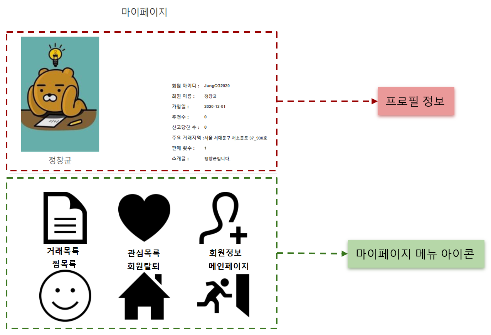

-----------------

## Schedule
- **Detailed Document** : can be found in each directory.

    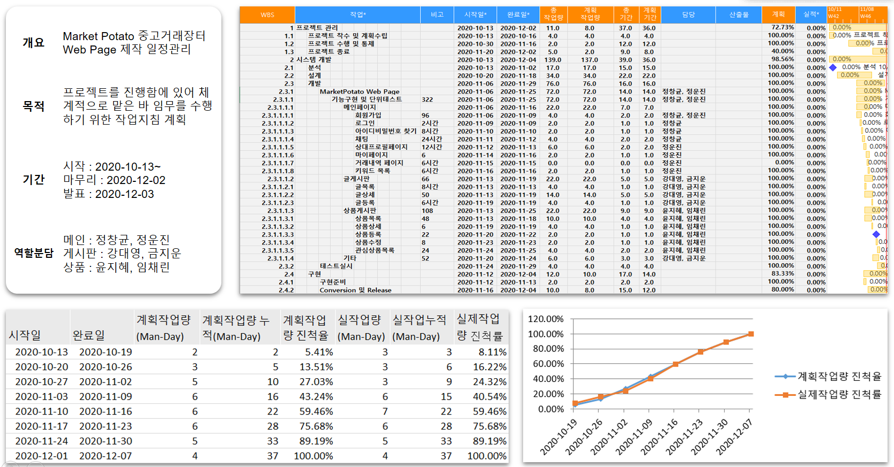

-----------------

## Document
- **Detailed Document** : can be found in each directory.

**1. 기능정의서**

    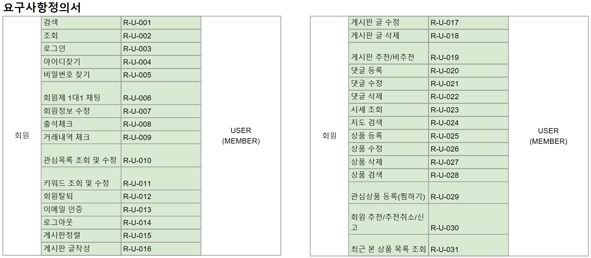

**2. 유스케이스**

    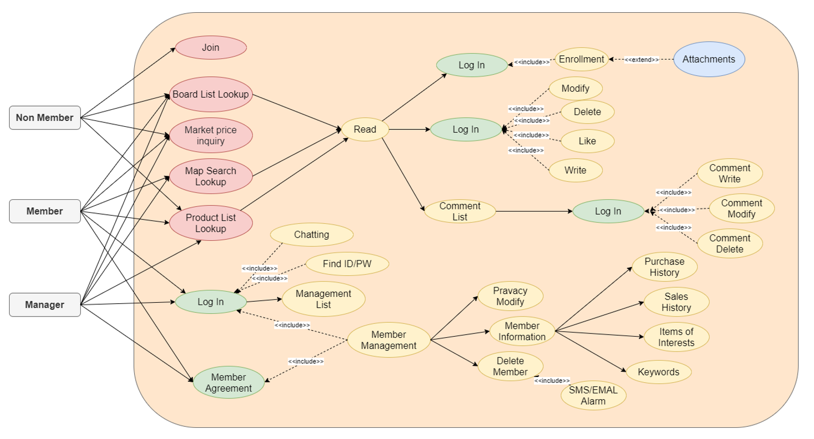

**3. UI 설계서**

    

**4. ERD**

    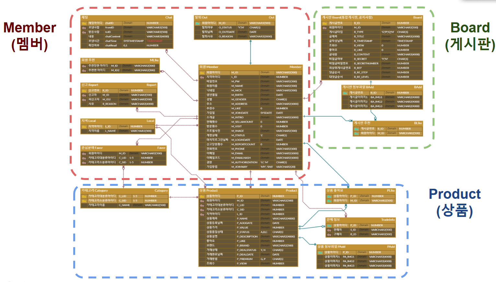

**5. 테이블 정의서**

    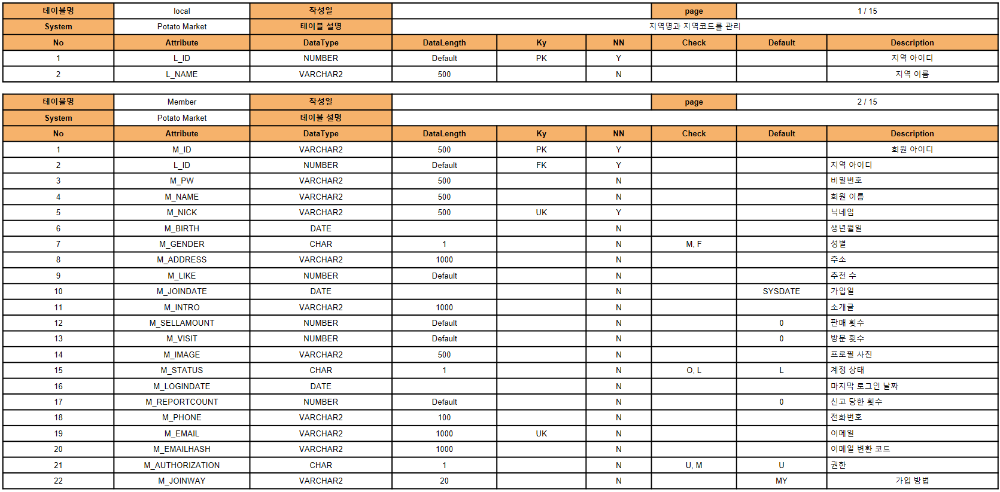

**6. 클래스 다이어그램**

    

**7. 시퀀스 다이어그램**

    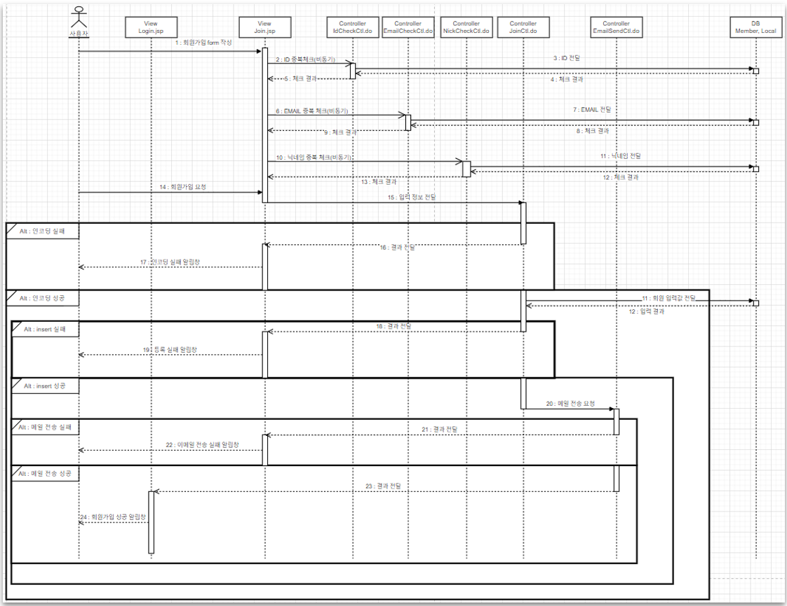

